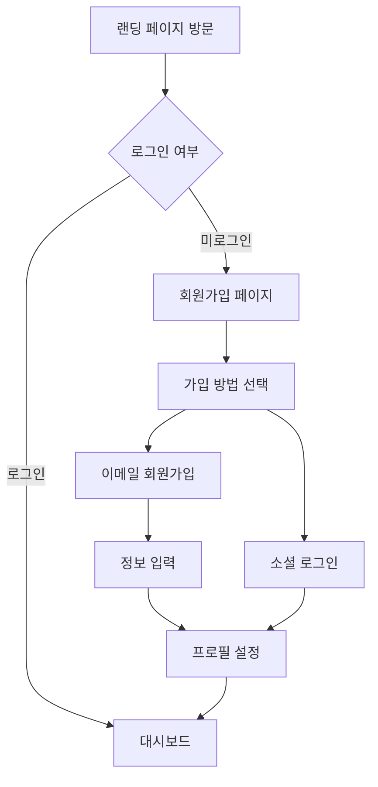
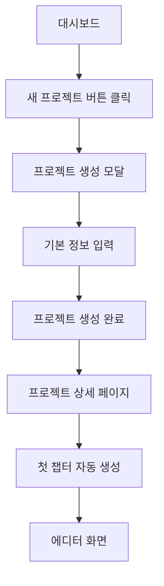
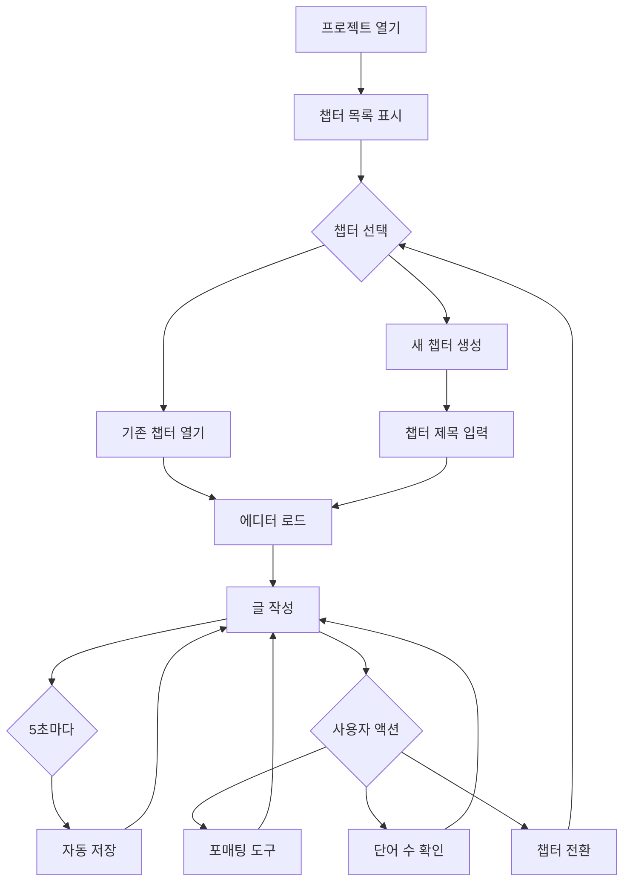
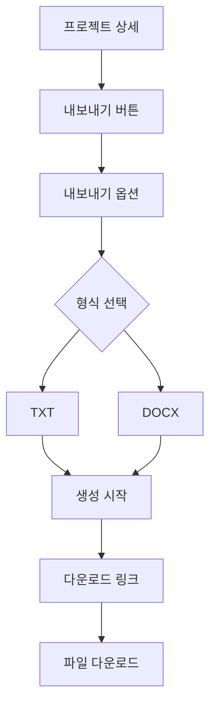
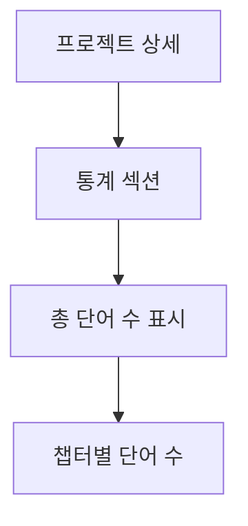

# User Flow Document
## 소설 쓰기 웹 애플리케이션 - MVP

---

## 1. 신규 사용자 온보딩 플로우



### 1.1 단계별 상세

**1단계: 랜딩 페이지**
- 사용자 액션: 사이트 방문
- 화면 요소:
  - 서비스 소개
  - "무료로 시작하기" CTA 버튼
  - "로그인" 링크

**2단계: 회원가입**
- 옵션:
  - 이메일/비밀번호
  - Google 계정
  - Kakao 계정

**3단계: 프로필 설정 (간소화)**
- 작가명 (닉네임)

---

## 2. 새 소설 프로젝트 생성 플로우



### 2.1 프로젝트 생성 폼 (간소화)

**필수 입력**:
- 프로젝트 제목

**선택 입력**:
- 장르 (드롭다운)
- 시놉시스
- 목표 단어 수

**Phase 2로 연기**: 템플릿 기능

---

## 3. 글쓰기 세션 플로우



### 3.1 에디터 화면 (MVP)

```
┌─────────────────────────────────────────────────────────────┐
│  [로고]  프로젝트명            [저장됨] [설정] [프로필]      │
├─────────────────────────────────────────────────────────────┤
│                                                               │
│  ┌───────────┐  ┌──────────────────────────────────────┐   │
│  │ 챕터 목록  │  │         에디터 영역                   │   │
│  │           │  │                                        │   │
│  │  � Ch1   │  │  Chapter 1: The Beginning              │   │
│  │  📄 Ch2   │  │                                        │   │
│  │  📄 Ch3   │  │  [B] [I] [U] [H1] [H2]                │   │
│  │           │  │  ────────────────────────────────     │   │
│  │           │  │                                        │   │
│  │           │  │  Once upon a time...                   │   │
│  │           │  │                                        │   │
│  │ + 새 챕터 │  │                                        │   │
│  └───────────┘  └──────────────────────────────────────┘   │
│                                                               │
├─────────────────────────────────────────────────────────────┤
│  단어: 1,234  |  문자: 6,789  |  오늘: 456 단어              │
└─────────────────────────────────────────────────────────────┘
```

### 3.2 에디터 기능 (MVP)

**툴바**:
- 굵게, 기울임, 밑줄
- 제목: H1, H2, H3
- 리스트: 순서, 비순서

**단축키**:
- `Ctrl + B`: 굵게
- `Ctrl + I`: 기울임
- `Ctrl + S`: 수동 저장

**사이드바**:
- 챕터 목록

**Phase 2로 연기**:
- ~~캐릭터 관리~~
- ~~세계관 관리~~
- ~~통계 대시보드~~
- ~~집중 모드~~

---

## 4. 프로젝트 내보내기 플로우



### 4.1 내보내기 (MVP)

**지원 형식**:
- ✅ TXT
- ✅ DOCX

**Phase 2/3로 연기**:
- ~~PDF~~
- ~~ePub~~

---

## 5. 통계 확인 플로우 (간소화)



### 5.1 통계 화면 (MVP)

```
┌─────────────────────────────────────────┐
│  작성 통계                               │
├─────────────────────────────────────────┤
│                                           │
│  총 단어 수: 45,678                       │
│                                           │
│  챕터별 단어 수:                          │
│  • Chapter 1: 3,456 단어                 │
│  • Chapter 2: 4,123 단어                 │
│  • Chapter 3: 2,890 단어                 │
│                                           │
└─────────────────────────────────────────┘
```

**Phase 2로 연기**:
- ~~일별/주별 그래프~~
- ~~작성 스트릭~~
- ~~목표 진행률 바~~

---

## 6. 모바일 플로우

### 6.1 모바일 에디터

```
┌─────────────────────┐
│ ☰  프로젝트명    ⋮  │
├─────────────────────┤
│                     │
│  Chapter 1          │
│                     │
│  Once upon a time.. │
│                     │
│                     │
│                     │
│                     │
│                     │
│                     │
├─────────────────────┤
│ [목록] [B I] [저장] │
└─────────────────────┘
```

---

## 7. 주요 사용자 시나리오 (MVP)

### 시나리오 1: 첫 소설 시작하기

**사용자**: 신규 작가 (김작가)

**목표**: 첫 판타지 소설 프로젝트를 만들고 첫 챕터를 작성한다.

**플로우**:
1. 회원가입 (Google 계정)
2. "새 프로젝트" 클릭
3. 제목: "마법사의 여정", 장르: 판타지
4. 자동 생성된 "Chapter 1" 열기
5. 에디터에서 500단어 작성
6. 자동 저장 확인 ("저장됨" 표시)
7. 통계에서 단어 수 확인: 500 단어

**결과**: 프로젝트 생성 및 첫 글쓰기 완료

---

### 시나리오 2: 작품 완성 및 내보내기

**사용자**: 작가 (이작가)

**목표**: 완성한 소설을 DOCX로 다운로드한다.

**플로우**:
1. 프로젝트 "로맨스 인 파리" 열기
2. 총 단어 수 확인: 85,234
3. "내보내기" 클릭
4. DOCX 선택
5. 다운로드 링크 클릭
6. 파일 다운로드

**결과**: DOCX 파일 획득

---

## 8. MVP에서 제외된 플로우

다음 플로우들은 **Phase 2/3로 연기**:

### 제외 목록
1. ❌ **캐릭터 관리 플로우** - Phase 2
2. ❌ **협업 및 공유 플로우** - Phase 2 (읽기 전용 공유만)
3. ❌ **버전 히스토리 플로우** - Phase 2
4. ❌ **통계 대시보드 플로우** - Phase 2
5. ❌ **실시간 협업 플로우** - Phase 3
6. ❌ **오프라인 작업 플로우** - Phase 3

---

## 9. 플로우 요약 (MVP)

| 플로우 이름 | 시작 지점 | 종료 지점 | 핵심 단계 수 |
|------------|----------|----------|-------------|
| 신규 가입 | 랜딩 페이지 | 대시보드 | 5단계 |
| 프로젝트 생성 | 대시보드 | 에디터 | 4단계 |
| 글쓰기 세션 | 프로젝트 열기 | 자동 저장 | 3단계 |
| 내보내기 | 프로젝트 상세 | 다운로드 | 5단계 |

---

## 10. MVP 핵심 원칙

> [!IMPORTANT]
> **MVP는 "글쓰기 + 저장 + 내보내기"에 집중합니다.**
> 
> 핵심 사용자 경험:
> 1. ✅ **쉽게 시작**: 빠른 가입 → 프로젝트 생성
> 2. ✅ **안전한 작성**: 자동 저장으로 데이터 손실 방지
> 3. ✅ **간편한 관리**: 챕터별 정리
> 4. ✅ **빠른 공유**: TXT/DOCX 다운로드
> 
> 복잡한 기능은 사용자 피드백을 받은 후 Phase 2에서 추가합니다.

---

## 11. 플로우 개선 전략

### 11.1 마찰 최소화

**가입 절차**:
- 소셜 로그인 우선 표시
- 이메일 인증은 선택사항

**에디터 로딩**:
- 에디터 즉시 사용 가능
- 자동 저장 피드백 명확히

**내보내기**:
- 원클릭 다운로드
- 대기 시간 최소화

### 11.2 사용자 가이드

**첫 방문 시**:
- 간단한 툴팁 (3개 이하)
- "샘플 프로젝트" 생성 옵션

**진행률 표시**:
- 단어 수 실시간 업데이트
- "저장됨" 상태 표시

---

이 User Flow 문서는 MVP 출시 후 사용자 피드백을 기반으로 업데이트됩니다.
