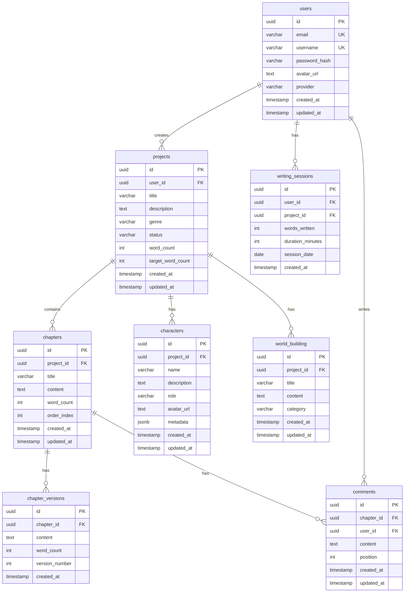

# Database Design
## 소설 쓰기 웹 애플리케이션

---

## 1. 개요

### 1.1 데이터베이스 선택

- **RDBMS**: PostgreSQL 15+
- **호스팅**: Supabase (개발/프로덕션)
- **ORM**: Prisma 5+

### 1.2 설계 원칙

1. **정규화**: 3NF (Third Normal Form) 준수
2. **확장성**: 인덱스 최적화 및 파티셔닝 고려
3. **무결성**: Foreign Key 제약조건 사용
4. **성능**: 자주 조회되는 컬럼에 인덱스 설정

---

## 2. ERD (Entity Relationship Diagram)



---

## 3. Prisma Schema

### 3.1 전체 스키마

```prisma
// prisma/schema.prisma
generator client {
  provider = "prisma-client-js"
}

datasource db {
  provider = "postgresql"
  url      = env("DATABASE_URL")
}

// ============================================
// User (사용자)
// ============================================
model User {
  id            String   @id @default(dbgenerated("gen_random_uuid()")) @db.Uuid
  email         String   @unique @db.VarChar(255)
  username      String   @unique @db.VarChar(50)
  passwordHash  String?  @map("password_hash") @db.VarChar(255)
  avatarUrl     String?  @map("avatar_url") @db.Text
  provider      String   @default("email") @db.VarChar(50) // 'email', 'google', 'kakao'
  createdAt     DateTime @default(now()) @map("created_at")
  updatedAt     DateTime @updatedAt @map("updated_at")

  // Relations
  projects         Project[]
  comments         Comment[]
  writingSessions  WritingSession[]

  @@map("users")
}

// ============================================
// Project (프로젝트/소설)
// ============================================
model Project {
  id              String   @id @default(dbgenerated("gen_random_uuid()")) @db.Uuid
  userId          String   @map("user_id") @db.Uuid
  title           String   @db.VarChar(255)
  description     String?  @db.Text
  genre           String?  @db.VarChar(100)
  status          String   @default("draft") @db.VarChar(50) // 'draft', 'in_progress', 'completed'
  wordCount       Int      @default(0) @map("word_count")
  targetWordCount Int?     @map("target_word_count")
  createdAt       DateTime @default(now()) @map("created_at")
  updatedAt       DateTime @updatedAt @map("updated_at")

  // Relations
  user            User              @relation(fields: [userId], references: [id], onDelete: Cascade)
  chapters        Chapter[]
  characters      Character[]       @relation("ProjectCharacters")
  worldBuilding   WorldBuilding[]   @relation("ProjectWorldBuilding")
  writingSessions WritingSession[]

  @@index([userId])
  @@map("projects")
}

// ============================================
// Chapter (챕터)
// ============================================
model Chapter {
  id         String   @id @default(dbgenerated("gen_random_uuid()")) @db.Uuid
  projectId  String   @map("project_id") @db.Uuid
  title      String   @db.VarChar(255)
  content    String?  @db.Text
  wordCount  Int      @default(0) @map("word_count")
  orderIndex Int      @map("order_index")
  createdAt  DateTime @default(now()) @map("created_at")
  updatedAt  DateTime @updatedAt @map("updated_at")

  // Relations
  project         Project          @relation(fields: [projectId], references: [id], onDelete: Cascade)
  versions        ChapterVersion[]
  comments        Comment[]

  @@index([projectId, orderIndex])
  @@map("chapters")
}

// ============================================
// Character (캐릭터) - Phase 2
// ============================================
model Character {
  id          String   @id @default(dbgenerated("gen_random_uuid()")) @db.Uuid
  projectId   String   @map("project_id") @db.Uuid
  name        String   @db.VarChar(255)
  description String?  @db.Text
  role        String?  @db.VarChar(100) // 'protagonist', 'antagonist', 'supporting'
  avatarUrl   String?  @map("avatar_url") @db.Text
  metadata    Json?    @db.JsonB // { age: 25, personality: "brave", ... }
  createdAt   DateTime @default(now()) @map("created_at")
  updatedAt   DateTime @updatedAt @map("updated_at")

  // Relations
  project Project @relation("ProjectCharacters", fields: [projectId], references: [id], onDelete: Cascade)

  @@index([projectId])
  @@map("characters")
}

// ============================================
// WorldBuilding (세계관) - Phase 2
// ============================================
model WorldBuilding {
  id        String   @id @default(dbgenerated("gen_random_uuid()")) @db.Uuid
  projectId String   @map("project_id") @db.Uuid
  title     String   @db.VarChar(255)
  content   String?  @db.Text
  category  String?  @db.VarChar(100) // 'location', 'rule', 'history', 'culture'
  createdAt DateTime @default(now()) @map("created_at")
  updatedAt DateTime @updatedAt @map("updated_at")

  // Relations
  project Project @relation("ProjectWorldBuilding", fields: [projectId], references: [id], onDelete: Cascade)

  @@index([projectId])
  @@map("world_building")
}

// ============================================
// ChapterVersion (챕터 버전) - Phase 2
// ============================================
model ChapterVersion {
  id            String   @id @default(dbgenerated("gen_random_uuid()")) @db.Uuid
  chapterId     String   @map("chapter_id") @db.Uuid
  content       String   @db.Text
  wordCount     Int      @map("word_count")
  versionNumber Int      @map("version_number")
  createdAt     DateTime @default(now()) @map("created_at")

  // Relations
  chapter Chapter @relation(fields: [chapterId], references: [id], onDelete: Cascade)

  @@index([chapterId])
  @@map("chapter_versions")
}

// ============================================
// Comment (댓글/피드백) - Phase 2
// ============================================
model Comment {
  id        String   @id @default(dbgenerated("gen_random_uuid()")) @db.Uuid
  chapterId String   @map("chapter_id") @db.Uuid
  userId    String   @map("user_id") @db.Uuid
  content   String   @db.Text
  position  Int?     // 텍스트 내 위치 (문자 인덱스)
  createdAt DateTime @default(now()) @map("created_at")
  updatedAt DateTime @updatedAt @map("updated_at")

  // Relations
  chapter Chapter @relation(fields: [chapterId], references: [id], onDelete: Cascade)
  user    User    @relation(fields: [userId], references: [id], onDelete: Cascade)

  @@index([chapterId])
  @@index([userId])
  @@map("comments")
}

// ============================================
// WritingSession (작성 세션/통계) - Phase 2
// ============================================
model WritingSession {
  id              String   @id @default(dbgenerated("gen_random_uuid()")) @db.Uuid
  userId          String   @map("user_id") @db.Uuid
  projectId       String?  @map("project_id") @db.Uuid
  wordsWritten    Int      @map("words_written")
  durationMinutes Int?     @map("duration_minutes")
  sessionDate     DateTime @map("session_date") @db.Date
  createdAt       DateTime @default(now()) @map("created_at")

  // Relations
  user    User     @relation(fields: [userId], references: [id], onDelete: Cascade)
  project Project? @relation(fields: [projectId], references: [id], onDelete: SetNull)

  @@index([userId, sessionDate])
  @@map("writing_sessions")
}
```

---

## 4. 테이블 상세 설명

### 4.1 users (사용자)

| 컬럼 | 타입 | 제약조건 | 설명 |
|------|------|----------|------|
| id | UUID | PK | 사용자 고유 ID |
| email | VARCHAR(255) | UNIQUE, NOT NULL | 이메일 (로그인용) |
| username | VARCHAR(50) | UNIQUE, NOT NULL | 사용자명 (작가명) |
| password_hash | VARCHAR(255) | NULLABLE | 비밀번호 해시 (소셜 로그인 시 NULL) |
| avatar_url | TEXT | NULLABLE | 프로필 이미지 URL |
| provider | VARCHAR(50) | DEFAULT 'email' | 가입 방법 ('email', 'google', 'kakao') |
| created_at | TIMESTAMP | DEFAULT NOW() | 생성 일시 |
| updated_at | TIMESTAMP | AUTO UPDATE | 수정 일시 |

**인덱스**:
- PRIMARY KEY: `id`
- UNIQUE: `email`, `username`

---

### 4.2 projects (프로젝트)

| 컬럼 | 타입 | 제약조건 | 설명 |
|------|------|----------|------|
| id | UUID | PK | 프로젝트 고유 ID |
| user_id | UUID | FK → users(id), NOT NULL | 작가 ID |
| title | VARCHAR(255) | NOT NULL | 프로젝트 제목 |
| description | TEXT | NULLABLE | 시놉시스/설명 |
| genre | VARCHAR(100) | NULLABLE | 장르 |
| status | VARCHAR(50) | DEFAULT 'draft' | 상태 ('draft', 'in_progress', 'completed') |
| word_count | INT | DEFAULT 0 | 총 단어 수 |
| target_word_count | INT | NULLABLE | 목표 단어 수 |
| created_at | TIMESTAMP | DEFAULT NOW() | 생성 일시 |
| updated_at | TIMESTAMP | AUTO UPDATE | 수정 일시 |

**인덱스**:
- PRIMARY KEY: `id`
- INDEX: `user_id`

**제약조건**:
- ON DELETE CASCADE: 사용자 삭제 시 프로젝트도 삭제

---

### 4.3 chapters (챕터)

| 컬럼 | 타입 | 제약조건 | 설명 |
|------|------|----------|------|
| id | UUID | PK | 챕터 고유 ID |
| project_id | UUID | FK → projects(id), NOT NULL | 프로젝트 ID |
| title | VARCHAR(255) | NOT NULL | 챕터 제목 |
| content | TEXT | NULLABLE | 챕터 내용 (HTML) |
| word_count | INT | DEFAULT 0 | 단어 수 |
| order_index | INT | NOT NULL | 정렬 순서 (0부터 시작) |
| created_at | TIMESTAMP | DEFAULT NOW() | 생성 일시 |
| updated_at | TIMESTAMP | AUTO UPDATE | 수정 일시 |

**인덱스**:
- PRIMARY KEY: `id`
- COMPOSITE INDEX: `(project_id, order_index)`

**제약조건**:
- ON DELETE CASCADE: 프로젝트 삭제 시 챕터도 삭제

---

### 4.4 characters (캐릭터) - Phase 2

| 컬럼 | 타입 | 제약조건 | 설명 |
|------|------|----------|------|
| id | UUID | PK | 캐릭터 고유 ID |
| project_id | UUID | FK → projects(id), NOT NULL | 프로젝트 ID |
| name | VARCHAR(255) | NOT NULL | 캐릭터 이름 |
| description | TEXT | NULLABLE | 캐릭터 설명 |
| role | VARCHAR(100) | NULLABLE | 역할 ('protagonist', 'antagonist', 'supporting') |
| avatar_url | TEXT | NULLABLE | 캐릭터 이미지 URL |
| metadata | JSONB | NULLABLE | 추가 속성 (나이, 성격, 외모 등) |
| created_at | TIMESTAMP | DEFAULT NOW() | 생성 일시 |
| updated_at | TIMESTAMP | AUTO UPDATE | 수정 일시 |

**metadata 예시**:
```json
{
  "age": 25,
  "personality": ["brave", "kind"],
  "appearance": "tall with dark hair",
  "backstory": "..."
}
```

---

### 4.5 world_building (세계관) - Phase 2

| 컬럼 | 타입 | 제약조건 | 설명 |
|------|------|----------|------|
| id | UUID | PK | 세계관 항목 ID |
| project_id | UUID | FK → projects(id), NOT NULL | 프로젝트 ID |
| title | VARCHAR(255) | NOT NULL | 제목 |
| content | TEXT | NULLABLE | 내용 |
| category | VARCHAR(100) | NULLABLE | 카테고리 ('location', 'rule', 'history', 'culture') |
| created_at | TIMESTAMP | DEFAULT NOW() | 생성 일시 |
| updated_at | TIMESTAMP | AUTO UPDATE | 수정 일시 |

---

### 4.6 chapter_versions (챕터 버전) - Phase 2

| 컬럼 | 타입 | 제약조건 | 설명 |
|------|------|----------|------|
| id | UUID | PK | 버전 ID |
| chapter_id | UUID | FK → chapters(id), NOT NULL | 챕터 ID |
| content | TEXT | NOT NULL | 저장된 내용 |
| word_count | INT | NOT NULL | 단어 수 |
| version_number | INT | NOT NULL | 버전 번호 (1, 2, 3, ...) |
| created_at | TIMESTAMP | DEFAULT NOW() | 저장 일시 |

**용도**: 실행 취소(Undo) 기능, 변경 이력 추적

---

### 4.7 comments (댓글) - Phase 2

| 컬럼 | 타입 | 제약조건 | 설명 |
|------|------|----------|------|
| id | UUID | PK | 댓글 ID |
| chapter_id | UUID | FK → chapters(id), NOT NULL | 챕터 ID |
| user_id | UUID | FK → users(id), NOT NULL | 작성자 ID |
| content | TEXT | NOT NULL | 댓글 내용 |
| position | INT | NULLABLE | 텍스트 내 위치 (문자 인덱스) |
| created_at | TIMESTAMP | DEFAULT NOW() | 작성 일시 |
| updated_at | TIMESTAMP | AUTO UPDATE | 수정 일시 |

**용도**: 베타 리더 피드백, 협업

---

### 4.8 writing_sessions (작성 세션) - Phase 2

| 컬럼 | 타입 | 제약조건 | 설명 |
|------|------|----------|------|
| id | UUID | PK | 세션 ID |
| user_id | UUID | FK → users(id), NOT NULL | 사용자 ID |
| project_id | UUID | FK → projects(id), NULLABLE | 프로젝트 ID |
| words_written | INT | NOT NULL | 작성한 단어 수 |
| duration_minutes | INT | NULLABLE | 작성 시간 (분) |
| session_date | DATE | NOT NULL | 작성 날짜 |
| created_at | TIMESTAMP | DEFAULT NOW() | 기록 일시 |

**용도**: 일별 작성량 통계, 작성 스트릭

---

## 5. 주요 쿼리 패턴

### 5.1 프로젝트 목록 조회 (최신순)

```typescript
// Prisma Query
const projects = await prisma.project.findMany({
  where: {
    userId: session.user.id,
  },
  orderBy: {
    updatedAt: 'desc',
  },
  include: {
    _count: {
      select: { chapters: true },
    },
  },
});

// SQL (참고)
SELECT p.*, COUNT(c.id) as chapter_count
FROM projects p
LEFT JOIN chapters c ON p.id = c.project_id
WHERE p.user_id = $1
GROUP BY p.id
ORDER BY p.updated_at DESC;
```

### 5.2 챕터 목록 조회 (순서대로)

```typescript
const chapters = await prisma.chapter.findMany({
  where: {
    projectId: projectId,
  },
  orderBy: {
    orderIndex: 'asc',
  },
  select: {
    id: true,
    title: true,
    wordCount: true,
    orderIndex: true,
  },
});
```

### 5.3 총 단어 수 업데이트

```typescript
// 챕터 저장 후 프로젝트 word_count 업데이트
const totalWordCount = await prisma.chapter.aggregate({
  where: {
    projectId: projectId,
  },
  _sum: {
    wordCount: true,
  },
});

await prisma.project.update({
  where: { id: projectId },
  data: {
    wordCount: totalWordCount._sum.wordCount || 0,
  },
});
```

### 5.4 챕터 순서 재정렬

```typescript
// 드래그 앤 드롭 후 순서 변경
await prisma.$transaction(async (tx) => {
  // 1. 이동할 챕터를 임시 순서로 변경
  await tx.chapter.update({
    where: { id: chapterId },
    data: { orderIndex: -1 },
  });

  // 2. 영향받는 챕터들 순서 조정
  await tx.chapter.updateMany({
    where: {
      projectId: projectId,
      orderIndex: { gte: newIndex },
    },
    data: {
      orderIndex: { increment: 1 },
    },
  });

  // 3. 이동할 챕터를 새 순서로 설정
  await tx.chapter.update({
    where: { id: chapterId },
    data: { orderIndex: newIndex },
  });
});
```

### 5.5 일별 작성량 통계 (Phase 2)

```typescript
// 최근 7일간 작성량
const sevenDaysAgo = new Date();
sevenDaysAgo.setDate(sevenDaysAgo.getDate() - 7);

const sessions = await prisma.writingSession.groupBy({
  by: ['sessionDate'],
  where: {
    userId: session.user.id,
    sessionDate: { gte: sevenDaysAgo },
  },
  _sum: {
    wordsWritten: true,
  },
  orderBy: {
    sessionDate: 'asc',
  },
});
```

---

## 6. 마이그레이션 전략

### 6.1 초기 마이그레이션

```bash
# 1. Prisma 초기화
npx prisma init

# 2. schema.prisma 작성 (위 스키마 참고)

# 3. 마이그레이션 생성
npx prisma migrate dev --name init

# 4. Prisma Client 생성
npx prisma generate
```

### 6.2 Phase별 마이그레이션

**Phase 1 (MVP)**:
- users
- projects
- chapters

**Phase 2**:
```bash
# characters, world_building, chapter_versions 추가
npx prisma migrate dev --name add_characters_and_world_building
```

**Phase 3**:
```bash
# comments, writing_sessions 추가
npx prisma migrate dev --name add_collaboration_features
```

---

## 7. 인덱스 최적화

### 7.1 필수 인덱스

```sql
-- projects 테이블
CREATE INDEX idx_projects_user_id ON projects(user_id);
CREATE INDEX idx_projects_updated_at ON projects(updated_at DESC);

-- chapters 테이블
CREATE INDEX idx_chapters_project_id ON chapters(project_id);
CREATE INDEX idx_chapters_order ON chapters(project_id, order_index);

-- writing_sessions 테이블
CREATE INDEX idx_writing_sessions_user_date ON writing_sessions(user_id, session_date);
```

### 7.2 복합 인덱스

```sql
-- 사용자별 프로젝트 상태 필터링
CREATE INDEX idx_projects_user_status ON projects(user_id, status);

-- 챕터 검색 (Phase 2)
CREATE INDEX idx_chapters_title_gin ON chapters USING GIN(to_tsvector('korean', title));
```

---

## 8. 데이터 백업 전략

### 8.1 Supabase 자동 백업

- 일 1회 자동 백업 (Supabase 기본 제공)
- Point-in-Time Recovery (PITR) 설정

### 8.2 수동 백업

```bash
# PostgreSQL dump
pg_dump $DATABASE_URL > backup_$(date +%Y%m%d).sql

# 복원
psql $DATABASE_URL < backup_20260104.sql
```

---

## 9. 데이터 시드 (개발용)

### 9.1 시드 스크립트

```typescript
// prisma/seed.ts
import { PrismaClient } from '@prisma/client';

const prisma = new PrismaClient();

async function main() {
  // 테스트 사용자 생성
  const user = await prisma.user.create({
    data: {
      email: 'test@example.com',
      username: 'testwriter',
      passwordHash: 'hashed_password',
      provider: 'email',
    },
  });

  // 테스트 프로젝트 생성
  const project = await prisma.project.create({
    data: {
      userId: user.id,
      title: '마법사의 여정',
      description: '한 소년의 모험 이야기',
      genre: '판타지',
      status: 'in_progress',
      targetWordCount: 100000,
    },
  });

  // 테스트 챕터 생성
  await prisma.chapter.createMany({
    data: [
      {
        projectId: project.id,
        title: 'Chapter 1: The Beginning',
        content: '<p>Once upon a time...</p>',
        wordCount: 500,
        orderIndex: 0,
      },
      {
        projectId: project.id,
        title: 'Chapter 2: Journey Begins',
        content: '<p>The adventure continues...</p>',
        wordCount: 750,
        orderIndex: 1,
      },
    ],
  });

  console.log('Seed completed!');
}

main()
  .catch((e) => {
    console.error(e);
    process.exit(1);
  })
  .finally(async () => {
    await prisma.$disconnect();
  });
```

```bash
# 시드 실행
npx prisma db seed
```

---

## 10. 성능 모니터링

### 10.1 쿼리 성능 체크

```typescript
// Prisma 쿼리 로깅 활성화
const prisma = new PrismaClient({
  log: [
    { level: 'query', emit: 'event' },
    { level: 'error', emit: 'stdout' },
  ],
});

prisma.$on('query', (e) => {
  console.log(`Query: ${e.query}`);
  console.log(`Duration: ${e.duration}ms`);
});
```

### 10.2 느린 쿼리 최적화

```sql
-- 실행 계획 확인
EXPLAIN ANALYZE
SELECT * FROM projects WHERE user_id = '...';

-- 인덱스 추가 후 재확인
CREATE INDEX idx_projects_user_id ON projects(user_id);
```

---

## 11. 보안 고려사항

### 11.1 Row-Level Security (Supabase)

```sql
-- 사용자는 자신의 프로젝트만 조회 가능
CREATE POLICY "Users can view own projects"
ON projects FOR SELECT
USING (auth.uid() = user_id);

-- 사용자는 자신의 프로젝트만 수정 가능
CREATE POLICY "Users can update own projects"
ON projects FOR UPDATE
USING (auth.uid() = user_id);
```

### 11.2 민감 정보 암호화

```typescript
// 비밀번호는 bcrypt로 해싱
import bcrypt from 'bcryptjs';

const hashedPassword = await bcrypt.hash(password, 12);
```

---

## 12. 확장 계획

### 12.1 파티셔닝 (대용량 데이터 대비)

```sql
-- writing_sessions 테이블을 월별로 파티셔닝
CREATE TABLE writing_sessions (
  -- columns...
) PARTITION BY RANGE (session_date);

CREATE TABLE writing_sessions_2026_01 PARTITION OF writing_sessions
FOR VALUES FROM ('2026-01-01') TO ('2026-02-01');
```

### 12.2 읽기 전용 복제본

- Supabase Read Replicas 사용 (Phase 3)
- 통계 조회는 복제본에서 처리

---

## 13. 마이그레이션 체크리스트

- [ ] Phase 1 테이블 생성 (users, projects, chapters)
- [ ] 인덱스 추가
- [ ] 시드 데이터 생성 (개발용)
- [ ] Prisma Client 생성
- [ ] 백업 설정
- [ ] Phase 2 마이그레이션 준비
- [ ] 성능 모니터링 설정

---

## 마무리

> [!TIP]
> **데이터베이스 설계 핵심**
>
> 1. ✅ **MVP 우선**: users, projects, chapters만 먼저 구현
> 2. ✅ **인덱스 최적화**: 자주 조회되는 컬럼에 인덱스
> 3. ✅ **정규화**: 데이터 중복 최소화
> 4. ✅ **확장성**: Phase 2/3 대비 설계
>
> Prisma를 사용하면 타입 안전성과 마이그레이션이 쉬워집니다!

---

**버전**: 1.0.0
**최종 수정일**: 2026-01-04
